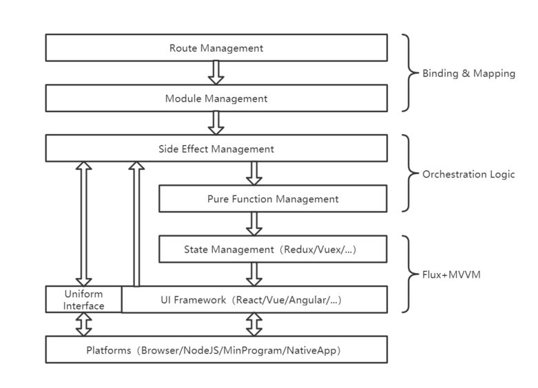

<div align="center">
  
  <h3>基于“微模块”和“模型驱动”的跨平台、跨框架的Web解决方案</h3>
  <em>我们不造轮子，不造车子，造的是底盘...</em>
  <p></p>
  <a href="https://www.npmjs.com/package/@elux/cli">
    
  </a>
  <a href="https://www.npmjs.com/package/@elux/core">
    
  </a>
  <a href="https://www.npmjs.com/package/@elux/core">
    
  </a>
  <a href="https://www.npmjs.com/package/@elux/core">
    
  </a>
  <p></p>
  <h2>
  ---🌱
  <a href="https://eluxjs.com">
    eluxjs.com
  </a>
   ---
  </h2>
  <p></p>
</div>

<table>
    <tr>
        <td width="50%" valign="top">
        <strong>微模块</strong>
        <p>从业务视角划分功能模块、实现应用级别的模块化。模块之间彼此隔离、可按需加载、是一种更细粒度的微前端。</p>
        </td>
        <td valign="top">
        <strong>模型驱动</strong>
        <p>将应用抽象成为数据模型，让业务逻辑不再受到平台、框架的干挠。给您一个上帝的视角理解和监察应用的运行。</p>
        </td>
    </tr>
    <tr>
        <td valign="top">
        <strong>跨平台、跨框架</strong>
        <p>支持单页应用、多页应用、服务器同构渲染(SSR)、小程序等运行平台；支持React、VUE、Taro、Redux、Vuex等泛Web框架...</p>
        </td>
        <td valign="top">
        <strong>简单易用</strong>
        <p>对各子框架无破坏性与侵入性的修改，还是您熟悉的味道。通过上层抽象与屏蔽差异，Learn Once, Write Anywhere...</p>
        </td>
    </tr>
</table>

## 快捷安装

推荐使用 cli 工具创建项目：

```javascript

    npm install @elux/cli -g

    elux init
```

## 部分 Feature

| 跨运行平台      |     |                                  |
| --------------- | --- | -------------------------------- |
| 浏览器渲染(CSR) | ✔   | 支持单页、多页、虚拟多页         |
| 服务器渲染(SSR) | ✔   | 支持 CSR、SSR 同构               |
| 服务器渲染(MSR) | ✔   | 支持部分 CSR + 部分 SSR 混合渲染 |
| 小程序          | ✔   | 支持 Taro 跨端框架               |
| Natvie APP      | ≈   | 后续支持 (ReactNative)           |

| 跨 UI 框架    |     |                   |
| ------------- | --- | ----------------- |
| React + Redux | ✔   | 支持 Class、Hooks |
| Vue + Vuex    | ✔   | 支持 Vue3         |
| 其它热门框架  | ≈   | 后续支持          |

| 特色路由 |     |                                                                      |
| -------- | --- | -------------------------------------------------------------------- |
| 抽象路由 | ✔   | 将路由状态化，不再需要 react-router、vue-router 等第三方框架         |
| 统一路由 | ✔   | 跨平台、跨框架使用同一套路由                                         |
| 外挂路由 | ✔   | 平台原生路由变成外挂模式，不再是强依赖，用或不用都不影响应用的运行   |
| 加强路由 | ✔   | 路由不仅可以控制页面的切换，还能控制弹窗、按钮等一切 UI 外观         |
| 虚拟多页 | ✔   | 解决 web 单页应用中由于路由切换导致 Dom 被更新，后退时无法还原的问题 |
| 可控路由 | ✔   | 统一拥有访问历史记录栈的能力、拥有路由拦截、守卫的能力               |
| 多栈路由 | ✔   | 统一拥有与小程序、NativeAPP 类似的多个路由栈                         |

| 微前端方案                   |     |                                                                                                                         |
| ---------------------------- | --- | ----------------------------------------------------------------------------------------------------------------------- |
| 独立开发、集中编译、集中发布 | ✔   | 各子工程独立开发，发布时集中编译。`优点：`产出代码经过静态编译的检查与优化，无冗余的重复代码、执行性能高。              |
| 独立开发、独立编译、独立发布 | ✔   | 借助于 Webpack5 的模块联邦 (Module Federation) `优点：`去中心化部署与升级、子应用可独立运行、无需整体打包，编译速度快。 |
| 跨子应用的 TS 类型检查与提示 | ✔   | 虽然各子工程独立开发，但 TS 类型的检查与提示不随工程的拆分而成为盲区                                                    |

## 架构



## 文档

- 官网：[eluxjs.com](https://eluxjs.com)
