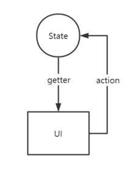
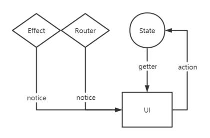
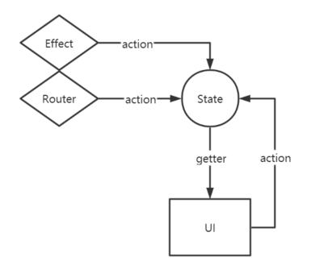

# 模型驱动

## 模型是什么？

模型是对业务逻辑的数据建模，是对业务逻辑的抽象表达。

模型与运行平台无关，也与编程语言无关，它是一种逻辑、一种抽象、一种提炼。形象的说它是整个应用运转的骨骼，而 UI 是它的皮肉，所谓的模型驱动，就是说用骨骼来驱动皮肉，而不是用皮肉来驱动骨骼。

## 模型跟状态有什么区别？

模型是一个可以运转的有机体，状态是它的一个切片。模型包括状态、以及驱动状态变化的各种方法：

看上图，或许感觉这与现在的很多单向数据流没什么区别，难道只是为了发明新名词吗？当然不是，实际项目中可没这么简单，我们不得不面对各种特定运行平台的事件、通知、路由等等：

看上图，我们 UI 的结果不再是纯粹的遵循 UI=render(State)，而是受到各种副作用的影响。那能否将这些副作用集中的隔离起来呢：

看上图，State 重新获夺取了 C 位，让该纯粹的回归纯粹，模型驱动也就建立起来了。  
需要强调的是，模型管理的是业务逻辑，而不是 UI 交互逻辑。UI 交互逻辑是 UI 组件内部事务，也是各种 MVVM 框架所解决的事情：

## 模型驱动的好处

让抽象的归抽象，让纯粹的归纯粹，透过模型我们可以用上帝的视角简单、明了、深刻的理解和观察应用的运行。模型本身与语言无关、与平台无关、与各种 UI 框架的各种生命周周期、各种魔性无关，所以它为跨语言、跨平台、跨框架的移植提供了无限可能。
